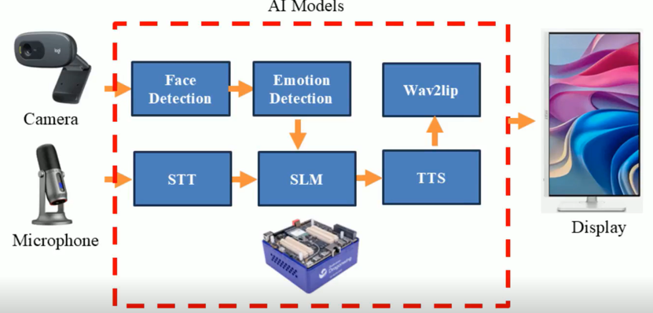

https://github.com/user-attachments/assets/b8841026-c7b2-45e7-8c91-f90492d98ffd

# Qualcomm IQ9075 Digital Human Edge AI Kiosk Turnkey Solution

## Advantages of IQ9075

1. IQ9075 can provide up to 100 TOPS of AI computing power and supports GPU and DSP accelerated computing
2. The Qualcomm Neural Processing (SNPE) SDK and the Qualcomm AI Engine Direct (QNN) can optimize the performance of trained neural networks
3. It supports Yocto and Ubuntu for AI development

## Performance Metrics

- **AI Model**:
  -	ASR (語音辨識)：Paraformer (ONNX Runtime)
  -	Emotion (情緒辨識)：ResNet50-based (QNN)
  -	MediaPipe(人臉辨識)：MediaPipe Face Detection (TFLite)
  -	MeloTTS (語音合成)：MeloTTS (QNN)
  -	Wav2Lip (唇形同步)：Wav2Lip (QNN)
  -	SLM (小型語言模型)：Phi-4-Mini-Instruct (QNN)

## Hardware

- **Platform**: IQ-9075 EVK
- **Microphone**:  Thronmax Mdrill One

## Software & Toolkit

- **Qualcomm AI Runtime (QAIRT) SDK**： 2.34.0.250424 & 2.36.3.250722
- **System:** Qualcomm Linux (Yocto)

## Background & Solution

### Motivation

Traditional kiosks provide only one-way information.Using edge AI, services evolve into human-like virtual assistants,upgrading from "self-service" to "intelligent assistance"

### Solution

Using edge digital human turnkey solution integrating all essential hardware, software, and edge AI SLM technologies can rapidly build their own customized digital human to replace traditional kiosks and achieve AI-driven service transformation

## Architecture Diagram

The camera and microphone capture video and audio, IQ9075 performs face and emotion detection, speech recognition, language understanding, and speech synthesis. 

## Demo

https://github.com/user-attachments/assets/5b77bffe-2e15-429c-a4a5-e620bcc1d4ab

https://github.com/user-attachments/assets/91b56c1e-727b-4811-901f-43ca5bf2e8d9

https://github.com/user-attachments/assets/06f71d0c-8ab6-4b45-9668-1e35d6e830ee

